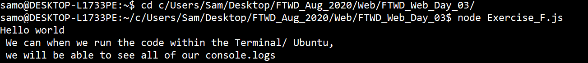

# Full Stack Software Engineering: Web Development Day 3 :rocket:

The exercise repos come with come boilerplate code, if you're confident and do not wish to follow these guidelines feel free to remove them!

### Main Topics :zap:

- Bootstrap Components
- Javascript Functions

### Directions :flashlight:

- Go to the LMS and follow the exercises:
  [Day 3](https://xccelerate.talentlms.com/unit/view/id:2573)

### How it works :open_book:

- [ ] Clone this repository, open the files and fill them out according to the directions

Method One:

- Opening index.html:

  - Right click on index.html
  - Hover over "Open with..."
  - Select your code editor (to change code) OR chrome (to see it)
  - Whenever you change your code, make sure to refresh the chrome page

  Method Two:

- Opening index.html from VS code:

  - Follow method one and open your file within VS code
  - Install the extension Live Server
  - Right click on the index.html and then select open with Live Server, when you are finished, click the close server button on the bottom right of VS code.

  

### Running JavaScript Code:

Method One:

- Open your browser and navigate to repl.it
- Create a JavaScript room, you will be able to code and execute the script within the browser by pressing the Run command

  

Method Two:

- Open an instance of the Terminal / Ubuntu
- Use the cd command to navigate to the directory that contains your JavaScript file that you would like to run
- Execute the file using the node command, followed by the file name: node exercise_a.js

  

## Exercises Due :athletic_shoe:

- [ ] Exercise A: Create a bootstrap page, place a bootstrap navigation bar, bootstrap list group and bootstrap buttons onto the page to mirror this image:

  

#### Bootstrap CDNs:

Place this link tag as well as the scripts in the correct places within your index.html

```
<link href="https://cdn.jsdelivr.net/npm/bootstrap@5.1.0/dist/css/bootstrap.min.css" rel="stylesheet" integrity="sha384-KyZXEAg3QhqLMpG8r+8fhAXLRk2vvoC2f3B09zVXn8CA5QIVfZOJ3BCsw2P0p/We" crossorigin="anonymous">

<script src="https://cdn.jsdelivr.net/npm/@popperjs/core@2.9.3/dist/umd/popper.min.js" integrity="sha384-eMNCOe7tC1doHpGoWe/6oMVemdAVTMs2xqW4mwXrXsW0L84Iytr2wi5v2QjrP/xp" crossorigin="anonymous"></script>
  
<script src="https://cdn.jsdelivr.net/npm/bootstrap@5.1.0/dist/js/bootstrap.min.js" integrity="sha384-cn7l7gDp0eyniUwwAZgrzD06kc/tftFf19TOAs2zVinnD/C7E91j9yyk5//jjpt/" crossorigin="anonymous"></script>

```

- [ ] Exercise B: Flowershop III, using the bootstrap column system OR finish all the grids on each of your web page, and add at least two widgets to your website.

* [ ] The four logos at the bottom should collapse to one vertical line on mobile site. (You can use the Chrome Toggle Device Toolbar feature to test for the mobile responsiveness of your website.)
* [ ] The four logos at the bottom should spread to one horizontal line on a large screen.
* [ ] The four logos should remain in two columns on a medium screen.

- [ ] Exercise C: Loop

- [ ] Exercise D: Multiply Number

- [ ] Finish the 'What is one thing that I learned from doing this project?' in the readme

## Bonus Exercises

- [ ] Exercise E: Maya's Weekly Articles

- [ ] Exercise F: Occurrence within a string

- [ ] Extra: Finish implementing the calculator function.

### Tips :tipping_hand_woman:

- We highly encourage you to follow practice the exercises; reading about code is not always enough, sometimes it's also important to practice implementing the specific steps. Don't worry if it feels difficult - that's normal. The important thing is to keep going, even when it feels hard :relaxed:

- If you get stuck, try to break down the problem. What small thing can you figure out first? Remember, instructors have a no touching your key board rule (we can help guide you, but won't debug for you!). Part of being a software engineer IS solving problems. It's a marathon, not a sprint :running_woman:

- Other debugging tips
  - [ ] Write down the logic of your code
  - [ ] Re-read documentation
  - [ ] Look at example code on github
  - [ ] Go slow. Do one thing at a time. You got this :muscle:

## What is one thing that I learned from doing this project? :books:

(Fill whatever you would like here)
